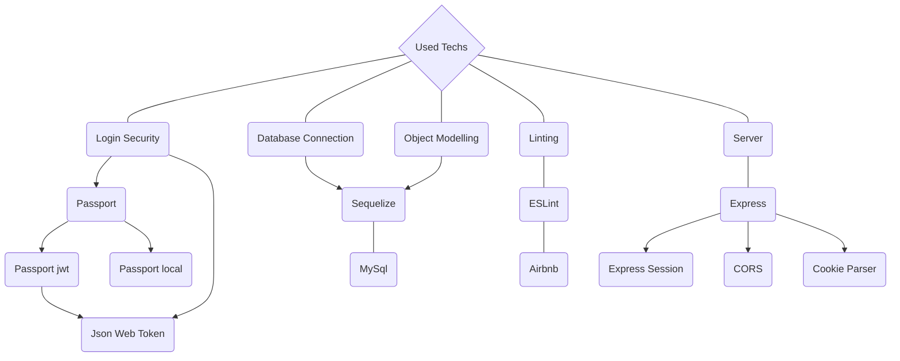

# Swiyt-Backend

```mermaid

graph TD
UT{Used Techs}
LS(Login Security)
LNT(Linting)
DB(Database Connection)
UM(Object Modelling)
SV(Server)
P(Passport)
	P1(Passport jwt)
	P2(Passport local)
JWT(Json Web Token)
SQ(Sequelize)
MY(MySql)
EX(Express)
EXS(Express Session)
COP(Cookie Parser)
CORS(CORS)
ESL(ESLint)
BNB(Airbnb)


UT --- LS
UT --- DB
UT --- UM
UT --- LNT
UT --- SV

LNT --- ESL
ESL --- BNB

LS --> P
LS --> JWT

P --> P1
P1 --> JWT
P --> P2

UM --> SQ
DB --> SQ
SQ --- MY

SV --- EX
EX --> EXS
EX --> CORS
EX --> COP


```
<!--stackedit_data:
eyJoaXN0b3J5IjpbMTI5OTQ4MDI5NiwxNzAwMzU3MTE4XX0=
-->