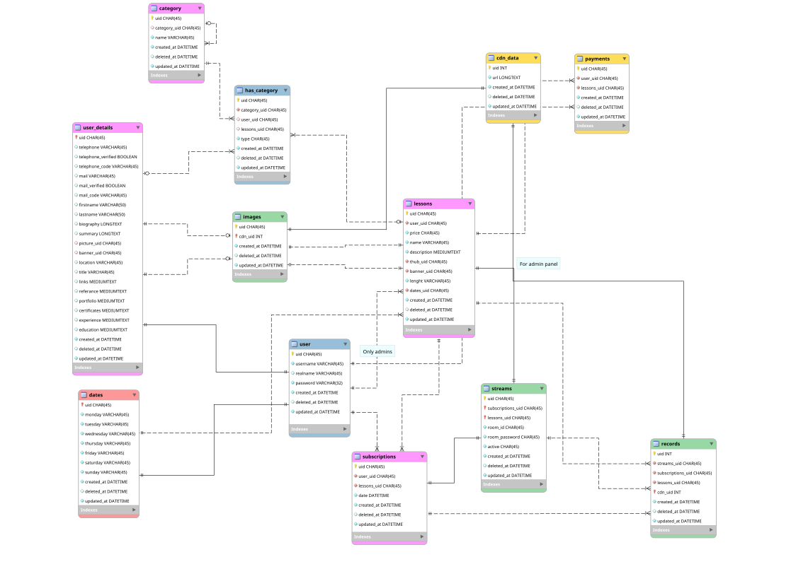

# Swiyt-Backend
|System Diagram|Database Diagram|
|--------|-------|
|[][System Diagram]|[][Database Diagram]|

## API Endpoints

### `/auth` Authentication
#### `/token`

Required Fileds

|Username|Password|
|--|--|
|Requiered|Requiered|

Returned Value

[System Diagram Link][System Diagram]
[Database Diagram Link][Database Diagram]

[System Diagram]: <https://bit.ly/2ls3TlU>
[Database Diagram]: <https://i.hizliresim.com/5Nnnrz.png>
<!--stackedit_data:
eyJoaXN0b3J5IjpbMTk5NTQ2MDQwNiw0NDY1MTk4MDJdfQ==
-->